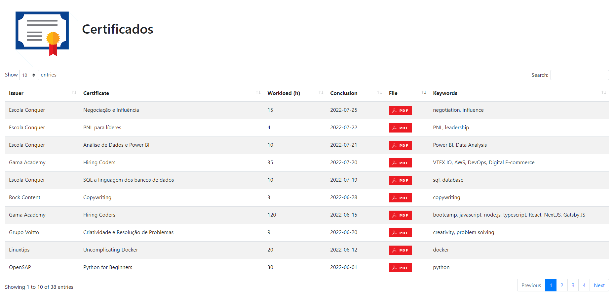

# Certificados

<a href="https://georgemaia.github.io/certificados" target="_blank">
    
</a>

Repositório com certificados de cursos, eventos e capacitações.

Certificates management using JavaScript on Github Pages with PDF download and keyword search on datatables.

URL: https://georgemaia.github.io/certificados


<a href="https://www.linkedin.com/in/georgemaia/">
    
</a>

## USAGE

In the settings page of the repository, turn on Github Pages. After, change the SERVER constant in the config.js with your full address of the certificates files.

```javascript
const SERVER = "http://localhost/certificados-repo/files/";
```

Change the FILENAME constant in the config.js with your certificates list in CSV format.

```javascript
const FILENAME = "certificados.csv";
```

Then upload the PDFs files in the folder of the server. Edit the csv file certificados.csv with yours certificates.

## JSON to Resume Schema

Exports the csv data to the JSON format used in Schema Resume. Just open resume-json.html and copy the JSON to the Github GIST.

```json
"certificates": [
    {
      "name": "Certificate",
      "date": "2025-06-06",
      "issuer": "Company",
      "url": "https://certificate.com"
    },
    {
      "name": "Certificate",
      "date": "2026-06-05",
      "issuer": "Company 2",
      "url": "https://certificate.com"
    }
  ]
```

Model to save in github gist: resume.json